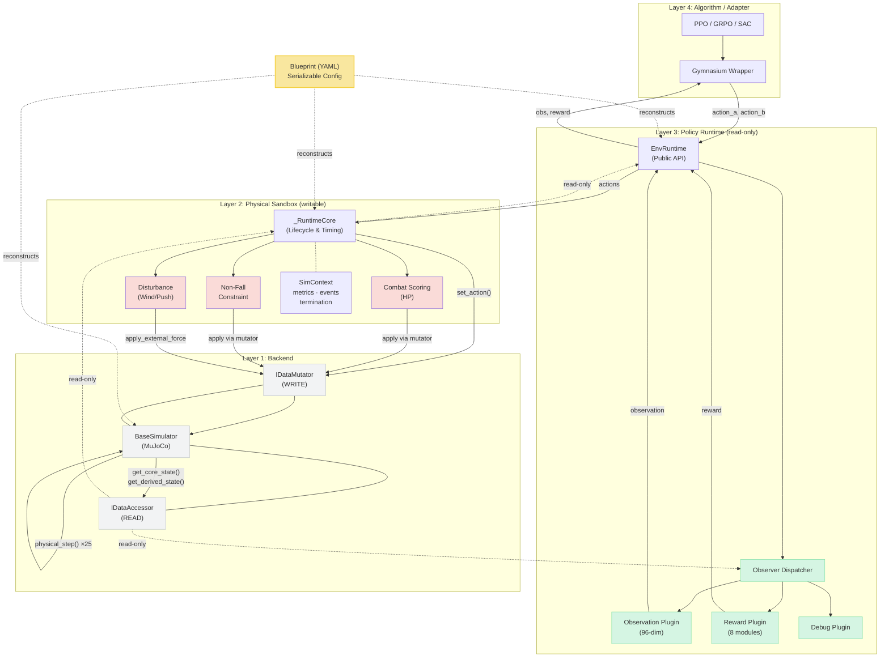

# CombatBench 架构图生成规格

> 本文档既是架构描述（可用于论文 Section 5 配图说明），也是生成架构图的提示词素材。
> 包含三种生成路径：AI 绘图提示词、Mermaid 代码、结构化文字规格。

---

## Part 1 — 架构概念描述（给 AI 的背景知识）

CombatBench 是一个 MuJoCo 双人 21-DOF 人形机器人对抗仿真平台。其框架采用**四层分层架构**，核心设计原则是：

1. **物理沙盒纯净**：底层物理引擎只做物理，不知道"比赛""得分"等概念。
2. **能力分离**：读权限（IDataAccessor）永远可用；写权限（IDataMutator）按需授予。
3. **世界规则与观测/奖励正交**：World Plugin 可改物理（裁判），Observer Plugin 只读（计分员），两者独立扩展。

### 四层架构（从上到下）

```
┌─────────────────────────────────────────────────────────┐
│  Layer 4: Algorithm / Adapter                            │
│  PPO / GRPO / SAC / Gymnasium Wrapper                    │
│  输入：observation；输出：action_a, action_b              │
├─────────────────────────────────────────────────────────┤
│  Layer 3: Policy Runtime                                 │
│  EnvRuntime（公共 API）                                   │
│    ↳ ObserverDispatcher（内部统一调度器）                  │
│       ↳ ObserverPlugin A: Observation（96-dim）          │
│       ↳ ObserverPlugin B: Reward（8 modules）            │
│       ↳ ObserverPlugin C: Debug / Scoring               │
│  只读，不碰物理                                            │
├─────────────────────────────────────────────────────────┤
│  Layer 2: Physical Sandbox                               │
│  _RuntimeCore（生命周期 / 时序调度 / 权限授予）             │
│    + World Plugins（可写，改物理）：                       │
│      • CombatScoringPlugin（HP 扣分）                     │
│      • NonFallConstraintPlugin（防摔约束）                │
│      • DisturbancePlugins（风 / 推力 / 初始扰动）         │
│    + SimContext（黑板：metrics / events / termination）  │
├─────────────────────────────────────────────────────────┤
│  Layer 1: Backend                                        │
│  BaseSimulator（MuJoCo 封装）                             │
│    IDataAccessor：get_core_state / get_derived_state...  │
│    IDataMutator：set_action / apply_external_force...    │
│  500Hz 物理，21-DOF × 2 robots                           │
└─────────────────────────────────────────────────────────┘
```

### 关键数据流

**动作流（自上而下）：**
```
Algorithm → action_a, action_b → EnvRuntime.step()
  → _RuntimeCore → [World Plugins: on_pre_action_step 可改动作]
  → BaseSimulator.set_action() → physical_step() × 25
  → [World Plugins: on_post_phy_step 可改状态]
```

**观测流（自下而上）：**
```
BaseSimulator → IDataAccessor
  → ObserverDispatcher（ReadOnlySimContext 转换，每步只做一次）
  → ObserverPlugins 批量调用
  → EnvRuntime.get_observer_output("observation")
  → Algorithm
```

**权限边界：**
- Observer Plugins → 只有 IDataAccessor（只读）
- World Plugins → 有 IDataAccessor + IDataMutator（可写，需声明 `require_mutator=True`）

### 横切关注点

- **Blueprint（蓝图）**：将 Layer 1-3 的完整配置（simulator + plugins + observer_plugins + 参数）序列化为一个 YAML 文件，实现实验可复现。
- **双 Agent**：整个 Runtime 同时管理 robot_a 和 robot_b，step() 接收两个动作。

---

## Part 2 — AI 绘图提示词（用于 DALL-E / Midjourney / Nano-Banana 等）

> 注意：文字密集型图表建议优先用 Part 3 的 Mermaid 代码渲染。
> 以下提示词适合生成**概念性、视觉化**的架构示意图。

### 英文提示词（推荐，出图质量更稳定）

```
Create a clean, professional software architecture diagram for a research
paper. The diagram shows a 4-layer layered architecture stacked vertically,
representing a reinforcement learning framework called "CombatBench" for
humanoid robot combat simulation.

LAYOUT: Four horizontal layers stacked top-to-bottom, separated by clear
horizontal dividers. Each layer is a wide rounded rectangle spanning the
full width.

LAYER 4 (TOP) — "Algorithm / Adapter Layer" (light blue background):
  Contains three small boxes side by side: "PPO / GRPO", "Gym Adapter",
  "Training Loop".
  A thick downward arrow labeled "action_a, action_b" exits the bottom
  of this layer.

LAYER 3 — "Policy Runtime Layer" (light green background):
  Contains one large box labeled "EnvRuntime (Public API)" on the left.
  Inside or to the right, a container labeled "Observer Dispatcher"
  holds three smaller boxes stacked: "Observation Plugin (96-dim)",
  "Reward Plugin (8 modules)", "Debug Plugin".
  These observer boxes have DASHED arrows pointing down (read-only access).
  A label says "READ-ONLY" in italic.

LAYER 2 — "Physical Sandbox Layer" (light orange background):
  Contains a central box labeled "_RuntimeCore (Lifecycle & Timing)".
  To its right, a container labeled "World Plugins (WRITABLE)" holds
  three boxes: "Combat Scoring (HP)", "Non-Fall Constraint",
  "Disturbance (Wind/Push)".
  To the left, a small cylinder/circle labeled "SimContext
  (Blackboard: metrics, events, termination)".
  World Plugins have SOLID arrows pointing down (write access).

LAYER 1 (BOTTOM) — "Backend Layer" (light gray background):
  One large box labeled "BaseSimulator (MuJoCo)".
  Two interface labels inside: "IDataAccessor (READ)" on the left,
  "IDataMutator (WRITE)" on the right.
  Below: "500 Hz Physics · 21-DOF × 2 Humanoids".

CROSS-CUTTING ELEMENT (right side, spanning all 4 layers vertically):
  A vertical strip/ribbon labeled "Blueprint (YAML Serialization)" with
  a document icon, indicating it serializes the entire stack. An arrow
  from this strip points left into the stack with label "reproducible
  config".

DATA FLOW ARROWS:
  - One thick DOWNWARD arrow on the left side labeled "Actions"
    flowing from Layer 4 to Layer 1.
  - One thick UPWARD arrow on the right side labeled "Observations /
    Rewards" flowing from Layer 1 to Layer 4.
  - Dashed arrows from Layer 3 (observers) to Layer 1 labeled
    "read-only accessor".

TWO AGENTS: On the far left and far right outside the stack, two small
robot icons labeled "Robot A (red)" and "Robot B (blue)", with arrows
showing both are managed by the Backend Layer.

STYLE:
  - Flat, minimalist, academic paper style (like IEEE/ACM conference figures)
  - Thin clean lines, rounded corners
  - Muted professional color palette (light blue, light green, light
    orange, light gray)
  - Clear sans-serif labels (e.g., Helvetica or Arial)
  - No 3D effects, no gradients, no shadows
  - White background
  - English labels throughout
  - High resolution, print quality
```

### 中文提示词（备用）

```
生成一张用于学术论文的软件架构图，展示名为 CombatBench 的强化学习框架的四层分层架构。

整体布局：四层水平堆叠，从上到下，每层是全宽的圆角矩形，层间有水平分隔线。

第四层（最顶层）—"算法/适配层"，浅蓝底色：
  包含三个并排小框："PPO/GRPO"、"Gym 适配器"、"训练循环"。
  底部有一根粗向下箭头标注"action_a, action_b"。

第三层—"策略运行时层"，浅绿底色：
  左侧大框"EnvRuntime（公共 API）"。
  右侧容器"Observer 调度器"内含三个小框："观测插件(96维)"、"奖励插件(8模块)"、"调试插件"。
  虚线箭头向下，标注"只读"。

第二层—"物理沙盒层"，浅橙底色：
  中央框"_RuntimeCore（生命周期/时序）"。
  右侧容器"世界插件（可写）"含三框："HP 计分"、"防摔约束"、"扰动注入"。
  左侧圆柱形"SimContext（黑板：metrics/events/termination）"。
  实线箭头向下，标注"可写"。

第一层（最底层）—"后端层"，浅灰底色：
  大框"BaseSimulator (MuJoCo)"，内含"IDataAccessor（读）"和"IDataMutator（写）"。
  下方标注"500Hz 物理 · 21自由度 × 2 机器人"。

横切元素（右侧贯穿四层）：
  竖向条带"Blueprint（YAML 序列化）"，带文档图标，箭头指向主栈，标注"可复现配置"。

数据流箭头：
  左侧粗向下箭头"动作"，从第四层流向第一层。
  右侧粗向上箭头"观测/奖励"，从第一层流向第四层。
  虚线箭头从第三层指向第一层，标注"只读访问"。

双 Agent：最左和最右各一个机器人图标，标注"Robot A（红）"和"Robot B（蓝）"。

风格：扁平极简，学术论文风格，细线圆角，柔和配色，无 3D 无阴影，白底，英文标注，高清印刷质量。
```

---

## Part 3 — Mermaid 代码（最可靠，可直接渲染）

> 将以下代码粘贴到 https://mermaid.live 或任何支持 Mermaid 的 Markdown 渲染器中。
> 导出 SVG/PNG 后可用于论文。



---

## Part 4 — 图中各元素对照表（论文 Figure Caption 参考）

| 图中元素 | 论文章节 | 代码位置 |
|----------|----------|----------|
| Layer 4: Algorithm/Adapter | §5.2 | `baseline/common/`, Gym wrappers |
| EnvRuntime (公共 API) | §5.2 | `envs/framework/env_runtime.py` |
| Observer Dispatcher | §5.4 | `envs/framework/observer_plugin.py` |
| Observer Plugins | §5.4 | `envs/humanoid21/observer_plugins.py` |
| _RuntimeCore | §5.2 | `envs/framework/env_runtime.py` |
| World Plugins (Scoring) | §5.4, §3.1 | `envs/humanoid21/plugins.py` |
| World Plugins (NonFall) | §5.4 | `envs/humanoid21/plugins.py` |
| Disturbance Plugins | §4.5 | `envs/humanoid21/disturbance_plugins.py` |
| SimContext (Blackboard) | §5.3 | `envs/framework/context.py` |
| BaseSimulator (MuJoCo) | §5.2 | `envs/humanoid21/simulator.py` |
| IDataAccessor / Mutator | §5.3 | `envs/framework/backend.py` |
| Blueprint (YAML) | §5.5 | `envs/framework/blueprint.py` |

---

## 建议的论文 Figure Caption

> **Figure 1.** CombatBench framework architecture. The system is organized in four layers. The **Algorithm/Adapter Layer** (top) hosts PPO/GRPO and Gymnasium wrappers. The **Policy Runtime Layer** exposes `EnvRuntime` as the public API and hosts read-only *Observer Plugins* (observation, reward, debug) via a unified dispatcher. The **Physical Sandbox Layer** drives `_RuntimeCore` with writable *World Plugins* (HP scoring, non-fall constraint, disturbances) that share state through the `SimContext` blackboard. The **Backend Layer** wraps MuJoCo behind the `IDataAccessor`/`IDataMutator` capability interface. The **Blueprint** ribbon (right) serializes the entire stack as reproducible YAML configuration. Solid arrows denote action/write flow; dashed arrows denote read-only data access.
