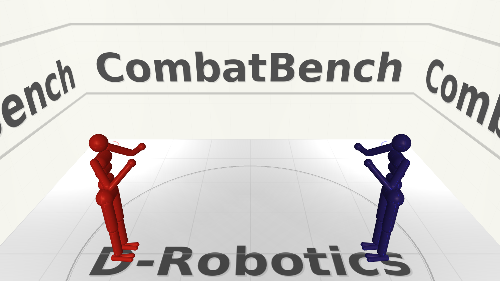

# CombatBench: Humanoid Robot Combat Benchmark



**Online platform: [www.combatbench.tech](http://www.combatbench.tech)** (fallback IP: [180.76.152.227](http://180.76.152.227)) — register, submit policies, watch matches, check Elo rankings.

CombatBench is an open-source humanoid robot combat simulation platform built on MuJoCo: two 21-DOF humanoid robots fight in a boxing ring, trained with reinforcement learning, and the goal is to drain the opponent's health to zero first. See [combat rules](docs/RULE.md) for details.

It is not just a single benchmark scene or a thin Gym wrapper — it is a reusable **environment runtime framework** for building robot-vs-robot tasks, and `humanoid21` is the first complete implementation built on top of it, accompanied by baseline policies, training methodology, and a public leaderboard. The project revolves around the [combatbench.tech](http://www.combatbench.tech) online platform (fallback IP [180.76.152.227](http://180.76.152.227)): participants register, submit policies, and the backend automatically runs matches and ranks them using Elo.

---

## Why CombatBench

The RL community has plenty of benchmarks, but they mostly fall into three categories: single-agent continuous control (MuJoCo, DM Control, IsaacGym), discrete games (Atari, Go, StarCraft), and manipulation (RoboSuite, Meta-World).

**Two high-DOF humanoid robots fighting in continuous physics** has no mature, maintained, public benchmark with rules and baselines.

This gap is worth filling because two-player combat is one of the hardest RL task types: it simultaneously demands whole-body balance, contact-rich control, fast reaction to non-stationary opponents, and attack-defense tradeoffs. There is also a practical reason — this task **does not require massive compute**; a mid-range GPU is enough to train competitive policies. What matters is policy ingenuity and training methodology.

We want to provide a competitive platform for developers interested in robot control. The CombatBench framework is flexible and extensible — you can build any idea on top of it, and if it cannot support your needs, please file an ISSUE. Here you can climb the leaderboard to showcase your skills, or just play for fun.

---

## What's in CombatBench

### 1. Simulation Environment: Humanoid21

Two 21-DOF humanoid robots fight in a 6.1m × 6.1m enclosed boxing ring.

- **Robot**: 21 DOF (waist 3 + each leg 6 + each arm 3), fixed-gain PD servo control. See [control spec](envs/humanoid21/CONTROLSPEC.md).
- **Observation**: 96-dim vector, four blocks — proprioception 42 + root state 13 + tactile 2 + opponent info 39. All opponent info is transformed into the ego frame; no absolute world coordinates to avoid position overfitting. See [data spec](envs/humanoid21/DATASPEC.md).
- **Action**: 21-dim normalized joint target positions, [-1, 1] range, 20Hz decision frequency.
- **Physics**: MuJoCo 500Hz, 25 physics substeps per action step, strictly symmetric parameters for both sides.

### 2. Framework: Extensible Runtime

The framework is built around a set of explicit abstract interfaces. Core interfaces, their roles, and existing implementations:

**`BaseSimulator`** — thin wrapper over the physics engine. Only handles stepping (`physical_step`), state read/write, force application. Knows nothing about "matches" or "scoring." It exposes capabilities to plugins via `IDataAccessor` / `IDataMutator` interfaces.
- Instances: `MujocoCombatSimulator` (humanoid21), T800 simulator (in integration)

**`IDataAccessor` / `IDataMutator`** — `BaseSimulator`'s capability-separated read/write contract. Accessor is always available (read-only: core state, derived state, sensor data); Mutator is granted on demand (write: set state, set action, apply force). World plugins declare `require_mutator=True` to write physics via Mutator; observer plugins only get Accessor and cannot accidentally modify physics.

**`SimContext`** — shared blackboard across plugins. Stores `metrics` (health, damage, counts), `events` (hits, out-of-bounds), `termination_proposals` (timeout / ko / foul). Plugins communicate through it rather than calling each other directly.

**`BasePlugin`** (world plugin) — referee for world rules, with 6 lifecycle hooks (pre/post episode, pre/post action step, pre/post physics step). Declare `require_mutator=True` to write physics.
- Instances: `CombatScoringPlugin` (HP deduction), `NonFallConstraintPlugin` (fall prevention), `InitialStatePerturbationPlugin` (initial perturbation), `ContinuousWindPlugin` (wind), `InstantPushPlugin` (instant push), `TimeoutPlugin` (timeout termination)

**`BaseObserverPlugin`** (observer plugin) — read-only output constructor, builds observations, rewards, debug signals from `IDataAccessor`. Dispatched in batch by the internal `_ObserverDispatcherPlugin`, with only one context switch per lifecycle.
- Instances: 96-dim observation constructor, 8 reward modules (`cross_support` / `damage` / `follow_opponent` etc.), balance analysis debugger

**`PostActionRecorder`** (recorder) — third type of runtime hook, peer-level with plugins but fundamentally different: pure side-effect, does not modify simulation state or produce outputs consumed by the runtime. Records pre-action observation, action, post-action observer outputs after each step, forming a complete $(s_t, a_t, s'_{t+1})$ transition snapshot.
- Instances: `BaseFrameRecorder` (disk format: per-step PNG image + JSON state, with manifest and index, sufficient for deterministic replay of every `IDataAccessor` read), `EpisodeBufferRecorder` (in-memory buffer for trainer consumption)
- Companion `ReplaySimulator`: implements `BaseSimulator` interface, replays from recording files — observer / plugin / training code can re-run on recorded data without modification, closing the loop of "record → frame-by-frame inspection → problem diagnosis"

World plugins and observer plugins are **orthogonal extension axes**: to change rules (e.g., add a foul system) add a world plugin; to change rewards or observation encoding add an observer plugin — they do not interfere. Recorders are a third axis independent of both — responsible for persisting key episodes during training for debugging and replay.

**`EnvRuntime`** — the public API for developers. `step(action_a, action_b)` drives both-sided actions, `get_observation()` returns observations, `get_observer_output()` returns rewards and other plugin outputs, `get_termination_flags()` returns termination status. Companion `RoundRunner` (single-round execution) and `MatchRunner` (multi-round match + HP accumulation).

**`EnvBlueprint`** — the entire environment serialized as YAML: simulator class + config, ordered world plugin list, observer plugin mapping, runtime parameters. Load one YAML file to fully reproduce someone else's experiment.

### 3. Baseline: Four-Stage Curriculum + Safety Gate

Training end-to-end on the full combat task fails (the robot cannot survive the first few seconds — exploration black hole). Our baseline decomposes the problem with a **four-stage curriculum**:

| Stage | Task | Difficulty |
|-------|------|------------|
| 1. Basic standing | Stand without perturbation | Joint coordination |
| 2. Balance recovery | Recover from initial state perturbation | Tilt resistance, push resistance |
| 3. Follow opponent | Track a moving opponent while balancing | Balance + locomotion + orientation |
| 4. Full combat | Fight under HP rules | Attack-defense tradeoff |

For detailed training procedures see [Baseline V1 Training Guide](baseline/humanoid21/curriculum/TRAINING_V1.md) and [Baseline V2 Training Guide](baseline/humanoid21/curriculum/TRAINING_V2.md). Framework documentation in [curriculum/README.md](baseline/humanoid21/curriculum/README.md).

**Safety Gate** is the core innovation of the baseline: an MLP classifier predicts whether the current state is safe, and when unsafe, control is handed to a frozen conservative recovery policy. It uses a hysteresis state machine — preferring to over-protect rather than risk handing control back too early.

### 4. Platform: [combatbench.tech](http://www.combatbench.tech)

**The website [www.combatbench.tech](http://www.combatbench.tech) (fallback IP [180.76.152.227](http://180.76.152.227)) is the public entry point for the project.** Participants register accounts, submit policies, the backend automatically runs matches, ranks them with Elo, and provides match videos and leaderboards.

The full flow: train policies locally using the framework and baseline → package and submit to combatbench.tech → backend auto-runs matches → Elo rankings update in real-time → watch match replays.

### 5. Methodology: AI Trains AI

Beyond the benchmark itself, the project contributes a training methodology. The core idea is similar to test-driven development (TDD): **define what a "healthy training" looks like before training**, then let AI monitor-diagnose-repair in a closed loop.

The training process outputs structured dashboards (not for humans, for programs), log analysis tools extract key metrics and flag alerts, AI periodically reviews health reports and troubleshoots problems per diagnostic protocols (KL early stopping, negative explained variance, entropy collapse, etc.), then adjusts hyperparameters or code, retrains, and loops.

---

## Installation

```bash
# Clone the repository
# git clone https://github.com/laddermoon/combatbench.git
# cd combatbench

# Install dependencies
pip install -e .
# or
pip install -r requirements.txt
```

---

## Quick Start

### Command Line

Run a single round (`RoundRunner`):

```bash
python -m envs.framework.round_runner \
  --env-blueprint envs/humanoid21/blueprint.yaml \
  --policy-a-blueprint policy/baseline/fight/u11936/policy_blueprint.yaml \
  --policy-b-blueprint policy/baseline/follow/u11416/policy_blueprint.yaml \
  --video match.mp4
```

Run a full match (`MatchRunner`, 6 rounds × 30s, HP accumulation):

```bash
python -m envs.framework.match_runner \
  --env-blueprint envs/humanoid21/blueprint.yaml \
  --policy-a-blueprint policy/baseline/fight/u11936/policy_blueprint.yaml \
  --policy-b-blueprint policy/baseline/follow/u11416/policy_blueprint.yaml \
  --total-rounds 6 \
  --video-dir videos/
```

### Python Code

Run a round and save video using Python:

```python
from envs.framework.blueprint import EnvBlueprint
from envs.framework.policy import PolicyBlueprint
from envs.framework.round_runner import RoundRunner
from envs.framework.common_plugins import VideoRecorderPlugin

# Load environment blueprint
blueprint = EnvBlueprint.load("envs/humanoid21/blueprint.yaml")

# Load preset baseline policies
fight_policy = PolicyBlueprint.load("policy/baseline/fight/u11936/policy_blueprint.yaml").build()
follow_policy = PolicyBlueprint.load("policy/baseline/follow/u11416/policy_blueprint.yaml").build()

# Run one round and record video
video = VideoRecorderPlugin(fps=30, output_path="match.mp4")
runner = RoundRunner(
    blueprint=blueprint,
    policy_a=fight_policy,
    policy_b=follow_policy,
    video_plugin=video,
)
result = runner.run(seed=42)
print(f"Steps: {result['steps']}, HP A: {result['health_a']}, HP B: {result['health_b']}")
```

More examples in the [`examples/`](examples/) directory, including full match evaluation (`06_evaluate_policy.py`) and episode recording (`09_episode_recorder_round_runner.py`).

---

## Project Structure

```
combatbench/
├── assets/          # MuJoCo XML models, textures, meshes
├── envs/
│   ├── framework/   # Reusable core framework (backend contracts, runtime, plugin system)
│   └── humanoid21/  # 21-DOF humanoid robot environment
├── policy/          # Preset policies (baseline training results, random, for evaluation)
├── baseline/        # Training baselines (PPO curriculum + safety gate)
│   └── humanoid21/
│       ├── curriculum/   # Four-stage curriculum training framework
│       ├── rewards/      # 8 composable reward modules
│       └── runs/         # 125+ training records
├── docs/            # Rules, environment specs, design documents
├── examples/        # 9 example scripts (covering full development cycle)
```

---

## Developing Your Own Strategy

CombatBench provides a complete baseline trained with four-stage curriculum learning + safety gate mechanism using PPO. You can build on this baseline to improve and create your own strategies — for example, replacing network architecture, adjusting reward design, introducing new curriculum stages, or using entirely different training methods (such as SAC, GRPO, imitation learning, etc.).

The framework is fully extensible: if the current interfaces cannot meet your needs, please file an ISSUE.

Related documentation:

- **Baseline overview**: [`baseline/humanoid21/README.md`](baseline/humanoid21/README.md) — directory structure, training flow, reward modules
- **Curriculum training framework**: [`baseline/humanoid21/curriculum/README.md`](baseline/humanoid21/curriculum/README.md) — Framework V1/V2 differences, experiment configs, CLI usage
- **Baseline V1 training guide**: [`baseline/humanoid21/curriculum/TRAINING_V1.md`](baseline/humanoid21/curriculum/TRAINING_V1.md)
- **Baseline V2 training guide**: [`baseline/humanoid21/curriculum/TRAINING_V2.md`](baseline/humanoid21/curriculum/TRAINING_V2.md)
- **Policy interface & blueprints**: [`envs/framework/DESIGN.md`](envs/framework/DESIGN.md) — `PolicyBlueprint` serialization, `Policy` abstract base class
- **Control spec**: [`envs/humanoid21/CONTROLSPEC.md`](envs/humanoid21/CONTROLSPEC.md) — action space, PD control, frequency conventions
- **Data spec**: [`envs/humanoid21/DATASPEC.md`](envs/humanoid21/DATASPEC.md) — observation vector layout, coordinate frame conventions

---

## Key Documentation

Design contracts and in-depth documents:

- **Framework architecture**: [`envs/framework/DESIGN.md`](envs/framework/DESIGN.md)
- **Humanoid21 observation design**: [`envs/humanoid21/OBSERVATION_zh.md`](envs/humanoid21/OBSERVATION_zh.md)
- **Humanoid21 data contract**: [`envs/humanoid21/DATASPEC.md`](envs/humanoid21/DATASPEC.md)
- **Humanoid21 control contract**: [`envs/humanoid21/CONTROLSPEC.md`](envs/humanoid21/CONTROLSPEC.md)
- **Humanoid21 baseline guide**: [`baseline/humanoid21/README.md`](baseline/humanoid21/README.md)
- **Training observability contract**: [`baseline/humanoid21/curriculum/OBSERVABILITY.md`](baseline/humanoid21/curriculum/OBSERVABILITY.md)

Rules and environment:

- [Combat Rules](docs/RULE.md) / [中文规则](docs/RULE_zh.md)
- [Environment Details](docs/ENVIRONMENT.md) / [中文环境](docs/ENVIRONMENT_zh.md)

---

## Who Is This For

- **RL researchers**: a new adversarial continuous control benchmark with complete environment, framework, and baselines.
- **Robotics control researchers**: high-DOF humanoid balance, recovery, and contact control under adversarial pressure.
- **Strategy/game theory researchers**: two-agent strategy evolution under HP rules with no restrictions.
- **Teams and individuals without massive compute**: this task has low compute requirements but high demands on strategy and methodology ingenuity.

---

## Roadmap

- More robot platforms (T800 humanoid partial integration, Unitree G1 planned)
- Vision-only sensing variant (remove opponent keypoints, use only ego-perspective images)
- AI-in-the-loop training methodology generalized to more RL task families
- Community contributions: the more policies on the leaderboard, the more strategy diversity emerges under HP-only rules

---

## Contributing

We welcome contributions! Please follow standard open-source pull request workflows.

---

## Links

- **Online platform (register / submit policies / rankings / match videos): [www.combatbench.tech](http://www.combatbench.tech) (fallback IP [180.76.152.227](http://180.76.152.227))**
- GitHub repository: [github.com/laddermoon/combatbench](https://github.com/laddermoon/combatbench)
