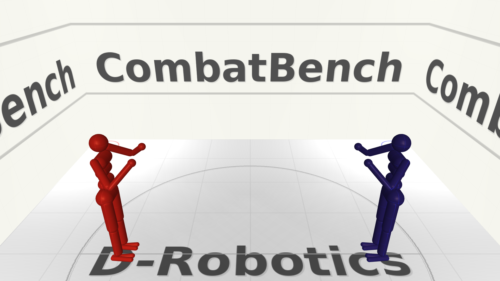

# CombatBench: 人形机器人对战基准平台



CombatBench 是一个用于人形机器人对战的开源仿真环境。它提供了一个基于 MuJoCo 的标准化环境，其中两个 21自由度 (21-DOF) 的人形机器人可以互相进行格斗。

## 特性

- **21自由度人形机器人**：具有脚踝关节的高保真机器人，能够实现更真实的格斗动作（移动、躲闪）。
- **标准对战竞技场**：标准的 6.1m x 6.1m 封闭房间，配备合理的灯光和多角度摄像机设置。
- **Gymnasium 接口**：标准强化学习环境接口（支持 `reset`, `step` 等）。
- **无头渲染 (Headless)**：基于 EGL 的快速渲染，用于生成格斗回放视频。
- **高可扩展性**：采用面向对象设计，支持未来接入新的机器人（如 宇树G1）以及纯视觉观测(Vision-based)的强化学习。

## 项目结构

- `assets/`: 仿真所需的 XML 模型、贴图纹理和网格文件。
- `core/`: 核心引擎组件（物理引擎、碰撞检测、得分计算、机器人运动学）。
- `envs/`: Gymnasium 环境封装 (`CombatGymEnv`)。
- `utils/`: 辅助脚本（如纹理生成、XML编译工具、策略验证打包工具）。
- `docs/`: 关于规则、机器人规格以及观测空间的详细文档。

## 安装指南

### 依赖要求

- Python 3.8+
- MuJoCo 3.x
- Gymnasium
- NumPy
- OpenCV (cv2)

### 环境配置

```bash
# 克隆仓库
# git clone https://github.com/your-org/combatbench.git
# cd combatbench

# 安装依赖项 (请确保你已经安装了 mujoco)
pip install mujoco gymnasium numpy opencv-python imageio egl
```

## 快速开始

你可以在没有任何控制策略的情况下运行环境以验证安装。这会生成一段执行随机动作的对战仿真，并保存为 MP4 视频。

```bash
python run_without_policy.py
```

## 文档

- [对战规则](docs/RULE_zh.md)
- [环境详情](docs/ENVIRONMENT_zh.md)
- [机器人规格](docs/ROBOT_zh.md)
- [观测空间](docs/OBSERVATION_zh.md)
- [场景概述](docs/SCENE_zh.md)
- [策略提交指南](docs/SUBMISSION_zh.md)

## 参与贡献

我们欢迎各位开发者的贡献！请遵循标准的开源 Pull Request 流程。
