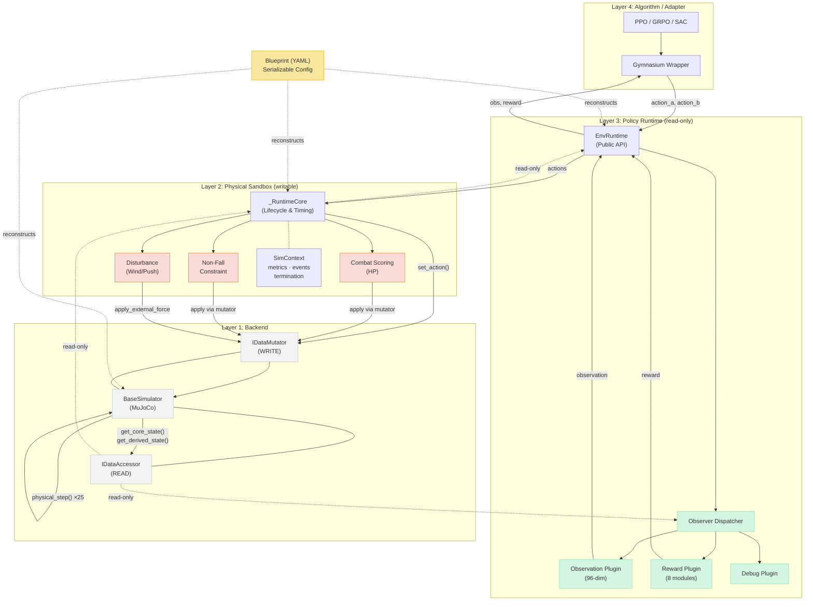

# CombatBench: An Adversarial Humanoid Benchmark with AI-in-the-Loop Training

<!-- Draft v0.1 — sections added incrementally.
     Placeholder markers [TBD: ...] indicate content pending data/exploration. -->

---

## Abstract

Reinforcement learning has driven remarkable progress in robotic locomotion, manipulation, and game playing, yet the problem of *two-player adversarial combat between embodied humanoid agents in continuous physics* remains largely unaddressed by existing benchmarks. Such combat demands a confluence of capabilities—whole-body balance under active attack, contact-rich interaction, rapid reactive planning, and strategic offense–defense trade-offs—that are absent from single-agent locomotion or manipulation tasks.

We introduce **CombatBench**, an open-source benchmark and platform for two-player humanoid robot combat in MuJoCo simulation. CombatBench prescribes Health-Point-based competition between two 21-DOF humanoids across six 30-second rounds, a 96-dimensional ego-centric observation space, normalized position control at 20 Hz, and a strictly symmetric 500 Hz physics environment with no fouls or posture restrictions—allowing agents to freely evolve any strategy. To support rapid research iteration, we provide a layered, plugin-based framework that cleanly separates world rules from observation and reward computation, and serializes entire environment configurations as reproducible YAML blueprints. We further contribute a baseline agent trained via a four-stage curriculum reinforced by a learned safety-gating network, and introduce an **AI-in-the-loop training methodology** that encodes PPO training-health criteria as machine-readable observability contracts, enabling an LLM agent to monitor, diagnose, and auto-remediate training runs in a closed loop—analogous to test-driven development for reinforcement learning.

[TBD: one sentence summarizing key experimental results — baseline win rates, survival rates, compute cost.] CombatBench is open-source and accompanied by a public Elo leaderboard at [TBD: URL].

---

## 1. Introduction

Embodied artificial intelligence has matured along several axes—legged locomotion, dexterous manipulation, and autonomous navigation—but the problem of *continuous physical combat between two embodied agents* has received comparatively little benchmark attention. This is striking because adversarial humanoid combat is, in a precise technical sense, strictly harder than its constituent sub-problems: a combat agent must simultaneously maintain whole-body balance, generate contact-rich strikes, react to an opponent whose policy is non-stationary, and arbitrate between offensive and defensive strategies over a long horizon. Each of these capabilities has been studied in isolation; their composition under adversarial pressure has not.

The benchmark landscape reflects this gap. Physics-based RL benchmarks such as the MuJoCo continuous-control suite [Duan et al., 2016], DeepMind Control Suite [Tassa et al., 2018], IsaacGym [Makoviychuk et al., 2021], and manipulation-focused environments like RoboSuite and Meta-World [Yu et al., 2020] are predominantly *single-agent*: the environment is passive. Game-playing benchmarks that do feature adversarial competition—Atari [Bellemare et al., 2013], Go [Silver et al., 2016], StarCraft II [Vinyals et al., 2019], Dota 2 [Berner et al., 2019]—operate in *discrete or game-abstract* action spaces, not continuous whole-body physics. The closest neighbor, emergent multi-agent competition in continuous control [Bansal et al., 2018], used simple low-DOF agents and did not establish a standardized, maintained benchmark with rules, baselines, and a leaderboard. A canonical, well-engineered benchmark for *high-DOF humanoid combat in continuous physics* is missing.

This gap matters for three reasons. First, combat is a uniquely demanding testbed for the core competencies of embodied RL: balance under external disturbance, contact-rich control, and strategy under a non-stationary opponent. Second, such tasks are *compute-accessible*: unlike benchmarks that require thousands of parallel environments on industrial-scale simulators, a single mid-range GPU is sufficient to train competitive policies—what matters is the *cleverness of the strategy and the training recipe*, not the scale of resources. This lowers the barrier to entry and diversifies who can participate. Third, simulation is the only setting where full-contact humanoid combat can be studied safely and reproducibly: robots can fall, collide, and be perturbed without physical damage or safety constraints, and the physics can be made strictly symmetric to guarantee fairness.

Building this benchmark presents three engineering and methodological challenges. **(C1)** Training a high-DOF humanoid under adversarial conditions is unstable: naive end-to-end training on the full combat task collapses because the agent rarely survives long enough to receive a strike-reward signal. **(C2)** The benchmark infrastructure must be simultaneously fair (strict symmetry), extensible (new robots, rules, rewards), and reproducible (fully serializable configurations). **(C3)** RL training itself is notoriously expert-dependent: recognizing whether a training run is healthy—let alone diagnosing and fixing it—requires tacit knowledge that creates a hidden barrier for new entrants.

We address all three with the following contributions:

- **C1 — The CombatBench task and rule set.** A Health-Point-based combat formulation for two 21-DOF humanoids: 6 rounds × 30 s, open-strategy rules with no fouls or posture restrictions, and damage calibrated to head (-3 HP) and torso (-1 HP) strikes under physical velocity and non-continuity conditions. The formulation is deliberately minimal to maximize strategic diversity (Section 3).

- **C2 — The Humanoid21 environment and extensible framework.** A 96-dimensional ego-centric observation space, normalized position control at 20 Hz over a 500 Hz MuJoCo physics backend, and a layered plugin architecture that cleanly separates *world rules* (writable plugins) from *observation and reward computation* (read-only observer plugins). Entire environments are serializable as YAML "blueprints" for bit-exact reproducibility, and the framework is backend-agnostic (Section 5). A second robot platform (T800) is partially integrated as an existence proof of extensibility.

- **C3 — A staged-curriculum baseline with a learned safety gate.** A four-stage curriculum (balance → balance recovery → opponent tracking → full combat) reinforced by a self-supervised *safety-gating network* that shields the policy during high-difficulty training, enabling stable training where naive end-to-end approaches collapse (Section 6).

- **C4 — AI-in-the-loop training methodology.** We formalize a closed-loop paradigm in which PPO training-health criteria are encoded as machine-readable observability contracts, and an LLM agent periodically monitors structured logs, diagnoses deviations, and remediates hyperparameters or code. We frame this as *test-driven development for RL training*: define what a healthy run looks like before training, then let an AI agent keep the run on course. The methodology is implemented with structured dashboards, automated log analyzers, and a diagnosis protocol, and generalizes beyond CombatBench (Section 7).

- **C5 — Open-source release and public leaderboard.** The full framework, environment, baseline, and a submission toolchain with an Elo-based public leaderboard.

The remainder of this paper is organized as follows. Section 2 surveys related work across RL benchmarks, competitive multi-agent learning, humanoid control, and automated ML. Section 3 defines the CombatBench task and rules. Section 4 details the Humanoid21 environment design. Section 5 presents the framework architecture. Section 6 describes the staged-curriculum baseline with safety gating. Section 7 introduces the AI-in-the-loop training methodology. Section 8 reports experimental results. Sections 9 and 10 discuss limitations and future work.

---

## 2. Related Work

<!-- Note: This section is a structural draft. It will be expanded with a full
     Deep Research survey. Key references below are anchors; completeness TBD. -->

### 2.1 Reinforcement Learning Benchmarks

A first line of work provides standardized environments for single-agent continuous control. The MuJoCo physics engine [Todorov et al., 2012] underpins several benchmark suites, including the empirical study by Duan et al. [2016] that established locomotion and balancing tasks as canonical testbeds. The DeepMind Control Suite [Tassa et al., 2018] formalized a closely related set of tasks with canonical reward definitions. IsaacGym [Makoviychuk et al., 2021] and its successor Isaac Lab [Mittal et al., 2023] pushed GPU-parallelized simulation to thousands of environments. For manipulation, RoboSuite and Meta-World [Yu et al., 2020] provide standardized tabletop tasks. Broader RL benchmarks include the Arcade Learning Environment [Bellemare et al., 2013; Machado et al., 2018], ProcGen [Cobbe et al., 2019], and navigation-oriented platforms such as Habitat [Savva et al., 2019] and AI2-THOR [Kolve et al., 2017].

**Relation and difference.** These benchmarks are overwhelmingly single-agent and task the agent with a *passive* environment. None feature a second embodied agent whose policy is adversarial and non-stationary, nor contact-rich full-body interaction between two humanoids. CombatBench targets precisely this gap.

### 2.2 Competitive, Adversarial, and Multi-Agent Reinforcement Learning

A second line of work studies adversarial competition, but largely in discrete or game-abstract settings. AlphaGo and AlphaZero [Silver et al., 2016; 2017] demonstrated superhuman board-game play through self-play. OpenAI Five [Berner et al., 2019] and AlphaStar [Vinyals et al., 2019] extended self-play to complex real-time strategy games. General multi-agent benchmarks include the Multi-Agent Particle Environments [Mordatch and Abbeel, 2018; Lowe et al., 2017], the StarCraft Multi-Agent Challenge [Samvelyan et al., 2019], and the PettingZoo library [Terry et al., 2021]. The closest neighbor to CombatBench is *emergent complexity through multi-agent competition* [Bansal et al., 2018], which trained simple agents to push, kick, and wrestle in continuous physics; however, that work used low-degree-of-freedom agents, did not standardize rules or scoring into a maintained benchmark, and did not consider high-DOF humanoid combat.

**Relation and difference.** Self-play at the scale of Go, StarCraft, or Dota demonstrates that adversarial competition drives capability, but these environments are game-abstract rather than embodied-physical. The continuous-control competition work of Bansal et al. [2018] is the nearest predecessor but does not provide the high-DOF humanoid, the HP-based rule set, the maintained framework, or the baseline methodology that CombatBench contributes.

### 2.3 Humanoid and Bipedal Control

A rich literature studies humanoid RL for locomotion, balance, and recovery. DeepMimic [Peng et al., 2018] introduced reference-motion imitation for full-body skills. AMP [Peng et al., 2021] and ASE [Peng et al., 2022] replaced explicit references with adversarial motion priors and skill embeddings. Work on push recovery and fall prevention studies how bipedal controllers reject disturbances [TBD: specific citations from Deep Research]. Curriculum-based training for humanoid robots has been explored in several settings [TBD].

**Relation and difference.** These works focus on *locomotion, imitation, or recovery in isolation*. CombatBench forces all of these to be maintained *simultaneously under active adversarial attack*, which fundamentally changes the control problem: the disturbance is not a stochastic push but a strategic agent.

### 2.4 Curriculum Learning and Safe Reinforcement Learning

Curriculum learning has a long history [Bengio et al., 2009] and has been applied to RL through reverse curricula [Florensa et al., 2017], automatic goal generation, and teacher–student scheduling [TBD: Graves et al.]. Safe RL methods constrain or shield policies during training, including shielded RL [Alshiekh et al., 2018], constrained policy optimization [Achiam et al., 2017], and recovery-policy architectures [TBD]. The use of a learned gating network that arbitrates between a main policy and a safe fallback has appeared in several forms [TBD].

**Relation and difference.** Our staged-curriculum baseline with a self-supervised safety gate (Section 6) builds on these ideas but combines them in a way specifically tailored to the stability challenges of high-DOF humanoid combat, where naive high-difficulty training collapses due to exploration black holes and value-function breakdown.

### 2.5 ML Observability, AutoML, and LLM-Driven Training

Hyperparameter optimization methods such as Hyperband [Li et al., 2018], BOHB [Falkner et al., 2018], and population-based training [Jaderberg et al., 2017] automate parts of the training configuration search, but treat the search as a black-box optimizer rather than an agent that *understands* training health. ML observability tooling—MLflow, Weights & Biases, TensorBoard—passively records metrics for human inspection. More recently, LLM-based agents have been applied to software engineering [TBD: SWE-agent, Devin, etc.] and to ML tasks, though primarily for code generation rather than closed-loop training operation.

**Relation and difference.** Our AI-in-the-loop methodology (Section 7) differs in two ways. First, it *explicitly encodes training-health criteria as a machine-readable contract* before training begins—the definition of "what a healthy PPO run looks like" is a first-class artifact. Second, the LLM agent is an *active diagnoser and remediator*, not a passive logger or black-box optimizer. To our knowledge, this TDD-for-RL framing is novel.

### 2.6 Positioning Summary

[TBD: After Deep Research, a consolidated paragraph stating CombatBench's unique combination of: (i) two-player adversarial + (ii) continuous physics + (iii) high-DOF humanoid + (iv) HP-based open-strategy rules + (v) AI-in-the-loop training methodology, and identifying the closest neighbors.]

---

## 3. The CombatBench Task

This section defines *what* a CombatBench agent must do: the combat rules, the design philosophy behind them, and the official evaluation protocol. The *implementation* of these rules—physics, observation, and control—is detailed in Sections 4 and 5.

### 3.1 Combat Rules

CombatBench formalizes humanoid combat as a *Health-Point (HP) depletion game* between two physically identical robots in a symmetric arena. The rules are intentionally minimal and unambiguous; they prescribe no fouls, no counts, and no posture restrictions.

**Match structure.** A match consists of **6 rounds**, each lasting **30 seconds**. Both robots begin each round from a canonical initial state: standing upright, face-to-face, separated by 2 meters, regardless of the previous round's outcome. Each robot begins with **100 HP**.

**Win conditions.**
- *KO victory.* If a robot's HP is reduced to 0, the match ends immediately and the other robot wins.
- *Time-limit victory.* If no KO occurs, the robot with higher HP at the end of 6 rounds wins.
- *Draw.* If HP values are equal at the time limit, the round (or match) is declared a draw.

**Valid strikes.** HP is deducted only when a strike satisfies all of the following:
- *Attacker part.* The strike is initiated by one of: hands, forearms, elbows, upper arms, feet, shins, knees, or thighs. Strikes with the torso or head do not deduct HP.
- *Target part.* The strike lands on the opponent's head (-3 HP) or torso (-1 HP). Strikes to any other body part do not deduct HP.
- *Physical conditions.* The relative collision velocity must exceed a threshold (ruling out slow pushes and clinching), and a single collision event deducts HP only once (ruling out continuous-contact farming).

**Control timing.** The policy decision frequency is **20 Hz** (one action every 50 ms). The physics simulation runs at **500 Hz** (25 physics steps per action). If a policy fails to emit an action in time, the previous action is held.

### 3.2 Design Philosophy: Why Health Points and No Fouls

The rule set embodies three deliberate design choices that distinguish CombatBench from human-combat sports such as boxing or mixed martial arts.

**HP-only scoring removes subjectivity.** Human combat sports rely on human judges and nuanced criteria (ring generalship, effective aggression, clean punching). These are inherently subjective and irreproducible. By reducing all outcomes to a single, physically grounded quantity—HP, determined entirely by detected collision events—CombatBench guarantees that every match outcome is deterministic and machine-verifiable.

**No fouls or posture restrictions maximize strategic diversity.** Boxing bans clinching, groundwork, headbutting, and strikes with certain body parts. These prohibitions exist to protect human fighters and to mimic a particular martial tradition. An AI agent has no such constraints: falling, rolling, ground-and-pound, clinching, pinning, and any posture are all legal. This deliberately opens the strategy space so that optimal policies need not mimic human martial arts and can evolve behaviors that humans would not consider.

**Strict physical symmetry guarantees fairness.** Both robots share identical mass, kinematics, actuator gains, and physics parameters. The arena is fully symmetric. The initial state is mirrored. This removes any first-mover or side advantage, ensuring that match outcomes reflect only policy quality.

### 3.3 Evaluation Protocol

**Single-match evaluation.** A match consists of 6 rounds under the rules above. The official outcome is the win/loss/draw result, the final HP of both robots, and the round-by-round HP trajectory.

**Ranking via Elo.** For the public leaderboard, agents are rated with an Elo system computed over a pool of head-to-head matches among submitted policies. [TBD: K-factor, initialization, match sampling protocol.]

**Determinism.** Given the same random seed, a match between two deterministic policies is bit-reproducible: the same observation trajectory, action trajectory, and collision events will occur. This is enforced by the Blueprint serialization (Section 5.5) and the fixed physics timestep.

---

## 4. Environment Design

This section details the Humanoid21 environment: the robot, the observation and action interfaces, the arena, and the disturbance interface. The design is driven by three principles—*minimalism* (the smallest interface that makes combat learnable), *ego-centric framing* (observations are in the agent's own frame to discourage position-overfitting), and *physical fidelity* (control is mediated by realistic PD servos, not direct torque access).

### 4.1 The Humanoid21 Robot

The agent controls a 21-degree-of-freedom humanoid derived from the canonical MuJoCo humanoid model, modified only cosmetically (red vs. blue livery). The kinematic structure is:

- **Abdomen (3 DOF):** yaw, pitch, roll—the trunk's rotational core.
- **Each leg (6 DOF × 2 = 12):** hip abduction, hip rotation, hip flexion, knee, ankle pitch, ankle roll—supporting locomotion, kicking, and balance.
- **Each arm (3 DOF × 2 = 6):** shoulder pitch/roll, elbow—sufficient for striking and guarding.

All 21 joints are position-controlled via fixed-gain PD servos (Section 4.3). Crucially, the PD gains ($K_P$ and $K_D$) are *not* exposed as configurable hyperparameters: they are intrinsic properties of the robot, calibrated offline against quantitative acceptance criteria so that every policy faces a physically consistent actuator response. This prevents the simulator from becoming a "soft" actuator that masks policy deficiencies.

### 4.2 Observation Space (96 Dimensions)

The observation is a 96-dimensional vector partitioned into four modules, summarized in Table 1. The design deliberately omits absolute world-frame $x/y$ coordinates to discourage strategies that overfit to arena position, and routes all opponent information through the agent's own local frame.

| Module | Dims | Contents |
|--------|------|----------|
| **Proprioception** | 42 | Normalized joint positions (21) and joint velocities (21) |
| **Root state** | 13 | Height $z$ (1); local orientation as the first two columns of the root rotation matrix (6); local-frame linear velocity (3); local-frame angular velocity (3) |
| **Tactile** | 2 | Scalar ground-reaction force magnitude for each foot |
| **Opponent** | 39 | Relative root pose and face-vector (9); 5 opponent keypoint positions in ego frame—head, left/right hand, left/right foot (15); corresponding keypoint velocities (15) |

The proprioception module gives the policy direct access to its own joint state. The root-state module provides spatial awareness without leaking absolute position: the height signal is the primary "am I falling" indicator, and the local-frame velocities encode momentum and impact response. The tactile module provides a minimal 2-dimensional contact sense through foot forces, enabling weight-shift and stance learning.

The opponent module is the most task-specific. Rather than providing the opponent's full joint state (which would be high-dimensional and partly irrelevant), CombatBench provides a compact *keypoint* representation: the head, hands, and feet of the opponent, expressed in the agent's local coordinate frame, along with their velocities. This is sufficient to detect an incoming strike (a fast-moving hand keypoint), to localize the head as a high-value target (-3 HP), and to read the opponent's footwork. The opponent's face-vector (a 3-component unit vector indicating heading) is included so the agent can infer whether the opponent is facing toward or away from it—a critical cue for both offense and defense.

### 4.3 Action Space: Normalized Position Control

The action is a 21-dimensional vector in $[-1, 1]^{21}$, interpreted as *normalized joint target positions*. The mapping from action to physical target is:

$$
\theta^{\text{target}}_i = a_i \cdot S_i + R_i
$$

where $R_i = (\theta^{\text{down}}_i + \theta^{\text{up}}_i)/2$ is the joint's midpoint reference, $S_i = (\theta^{\text{up}}_i - \theta^{\text{down}}_i)/2$ is its half-range, and $\theta^{\text{down}}, \theta^{\text{up}}$ are the physical joint limits. Thus $a_i = 0$ commands the midpoint, $a_i = +1$ the positive limit, $a_i = -1$ the negative limit.

The target is tracked by a PD servo:

$$
\tau_i = K_{P,i}(\theta^{\text{target}}_i - q_i) - K_{D,i} \dot q_i
$$

with the resulting torque clamped to actuator limits before being applied. The gains $K_{P,i}$ and $K_{D,i}$ vary per joint—load-bearing hip and knee joints are stiffer than the lighter arm joints—and are fixed constants baked into the environment.

We choose *absolute* normalized position control (rather than delta/velocity control) for three reasons: (i) it provides a stable initialization point ($a = 0$ corresponds to a natural standing pose), (ii) it makes policies transferable across environments that share the same joint limits, and (iii) it matches the dominant convention in humanoid locomotion research, lowering the barrier for new entrants.

### 4.4 Arena and Physics

The arena is a fully enclosed room—a floor, four walls, and a ceiling—sized to the AIBA amateur boxing standard: **6.10 m × 6.10 m**, with a ceiling height of **6.10 m**. Both robots begin at the centerline, 1 m from center on opposite sides (2 m apart), standing upright and face-to-face. Four light sources are placed at the corners at 5 m height. Nine fixed cameras (four corners at 4 m, four wall midpoints at 3 m, one overhead) provide broadcast and evaluation views.

The physics backend is MuJoCo at a fixed **500 Hz** timestep ($\Delta t = 2\text{ ms}$). Each 20 Hz policy decision therefore spans **25 physics substeps**, which keeps contact resolution stable during fast strikes. Physics parameters, masses, and actuator properties are strictly identical for both robots. This, combined with the mirrored initial state, makes the environment *deterministic and symmetric*: a deterministic policy pair produces a bit-reproducible match given the same seed.

### 4.5 Disturbance Interface

To support research on robustness and sim-to-real transfer beyond the canonical combat task, CombatBench exposes a disturbance interface through three plugin families (Section 5.4):

- **Continuous wind:** applies a steady or time-varying external force field to the torso.
- **Instant push:** applies an impulse to a specified body link at a specified time.
- **Initial-state perturbation:** randomizes the initial joint offsets, root tilt, and angular velocity at episode reset—this is the primary mechanism used in the balance-recovery curriculum stage (Section 6.2).

These plugins compose with the combat plugins and can be enabled per experiment via the Blueprint configuration, allowing researchers to study how policies degrade under realistic physical disturbances without modifying the core environment.

---

## 5. Framework Architecture

CombatBench is not only an environment but also a reusable framework designed to make the benchmark *extensible* (new robots, rules, rewards, and backends) and *reproducible* (entire environments serializable as configuration). This section presents the architecture as a set of design contributions.

### 5.1 Design Goals

Three goals shape the architecture:

1. **Extensibility.** Adding a new robot, a new world rule, a new reward function, or a new physics backend should require *no modification to existing code*—only the addition of a self-contained module and a declaration in configuration.
2. **Reproducibility.** An entire experiment—simulator, plugins, parameters, and policy—should be captured by a single serializable configuration file that can be shared, diffed, and re-executed bit-exactly.
3. **Backend agnosticism.** The framework's contracts should not assume MuJoCo specifically, so that future backends (PyBullet, Isaac, Genesis) can be integrated without rewriting the plugin ecosystem.

### 5.2 Layered Architecture

The framework is organized in four layers (Figure 1). Solid arrows denote action and write flows; dashed arrows denote read-only data access.



**Figure 1.** CombatBench framework architecture. The system is organized in four layers. The **Algorithm/Adapter Layer** (top) hosts PPO/GRPO and Gymnasium wrappers. The **Policy Runtime Layer** exposes `EnvRuntime` as the public API and hosts read-only *Observer Plugins* (observation, reward, debug) via a unified dispatcher. The **Physical Sandbox Layer** drives `_RuntimeCore` with writable *World Plugins* (HP scoring, non-fall constraint, disturbances) that share state through the `SimContext` blackboard. The **Backend Layer** wraps MuJoCo behind the `IDataAccessor`/`IDataMutator` capability interface. The **Blueprint** (right) serializes the entire stack as reproducible YAML configuration.

- **Backend layer.** `BaseSimulator` is a thin wrapper over the physics engine, exposing only joint read/write, force application, and `physical_step()`. It is explicitly forbidden from knowing about scoring, episodes, or game rules.
- **Physical sandbox layer.** `_RuntimeCore` drives one simulator together with an ordered list of *world plugins* according to a fixed lifecycle (Section 5.4). It owns episode timing, plugin ordering, and capability granting.
- **Policy runtime layer.** `EnvRuntime` is the public entry point: it accepts the two agents' actions per step, drives the sandbox, dispatches observer plugins, and exposes their outputs.
- **Algorithm / adapter layer.** Gymnasium adapters, SB3 wrappers, and custom trainers sit on top of `EnvRuntime` as thin shims. They are *not* the framework's core.

### 5.3 Capability-Based Access: Accessor and Mutator

A central design decision is the strict separation of *read* and *write* capability at the interface level, following the principle of least authority.

- **`IDataAccessor`** (always granted, read-only) exposes: static configuration (`get_static_data`), raw physics state (`get_core_state`: qpos, qvel, root pose), derived state (`get_derived_state`: contacts, kinematics), and sensor data (`get_sensor_data`: IMU, foot forces).
- **`IDataMutator`** (selectively granted) adds: `set_core_state` (for reset and perturbation), `set_action` (for action clamping or mapping), and `apply_external_force` (for disturbances).

Only world plugins that declare `require_mutator = True` receive write access; observer plugins never do. This prevents a reward-computation module from accidentally (or maliciously) perturbing the physics, and keeps the trust boundary explicit.

### 5.4 World Plugins versus Observer Plugins

The most important architectural distinction for RL research is between two plugin types:

**World plugins** (`BasePlugin`) implement *world rules*. They receive write access (if declared) and hook into six lifecycle points: `on_pre_episode`, `on_pre_action_step`, `on_pre_phy_step`, `on_post_phy_step`, `on_post_action_step`, and `on_post_episode`. CombatBench's combat rules are implemented this way—`CombatScoringPlugin` computes HP depletion from collision events, `NonFallConstraintPlugin` applies stabilizing constraints, and the disturbance plugins (Section 4.5) inject forces.

**Observer plugins** (`BaseObserverPlugin`) compute *read-only outputs*—observations, rewards, and debug signals—directly from the `IDataAccessor` contract. They are managed by a single internal dispatcher (`_ObserverDispatcherPlugin`) that performs one read-only context transformation per lifecycle point and then batch-calls all registered observers, minimizing overhead.

**Why this matters for RL research.** A researcher who wants to experiment with a different reward shaping, a different observation encoding, or an additional debug signal can do so by adding a *single observer plugin*, without touching the physics, the world rules, or the scoring. This is the primary mechanism by which CombatBench supports reward-engineering and representation-learning research. Conversely, a researcher who wants a new *rule* (e.g., allowing groundwork scoring, or adding a foul system) adds a world plugin. The two axes of extension are cleanly orthogonal.

### 5.5 Blueprint: Serializable Environments

Reproducibility in RL is notoriously difficult, in part because an "environment" is often an opaque Python object whose behavior depends on hidden constructor arguments, global state, and library versions. CombatBench addresses this with the **Blueprint** abstraction: a complete environment specification that can be serialized to YAML and round-tripped losslessly.

A Blueprint captures:
- the simulator class and its configuration (e.g., initial distance, initial pose),
- the ordered list of world plugins and their configurations,
- the named map of observer plugins and their configurations,
- runtime knobs (physics steps per action, max steps, strict mode),
- a parameter table with defaults and descriptions.

Blueprints compose: a `ParameterizedEnvBlueprint` supports `${variable}` substitution, allowing curriculum experiments to programmatically override parameters. This makes it possible to share an entire experimental setup as a single YAML file, and to reproduce another group's results by loading that file. We consider this a first-class contribution to RL benchmarking infrastructure.

### 5.6 Extensibility Evidence: The T800 Platform

The framework's extensibility claim is not merely architectural. A second robot platform—the **T800**, a higher-DOF humanoid with distinct kinematics—has been partially integrated into CombatBench: full mesh assets, URDF and MuJoCo XML models, a `BaseSimulator` implementation, combat and observer plugins, and an arena definition are present in the codebase. The T800 baseline is work in progress; nonetheless, its integration demonstrates that the framework accommodates a substantially different robot without changes to the core runtime, plugin contracts, or Blueprint system. We discuss T800 and additional platforms as future work in Section 10.

---

## 6. Baseline: Staged Curriculum with Safety Gating

A naive attempt to train a combat policy end-to-end—from random initialization on the full 6-round HP-depletion task—fails. The agent cannot survive the first seconds of a round, so it never experiences a strike, never receives a damage-reward signal, and the value function collapses. This is a textbook case of the * exploration black hole *: every rollout consists entirely of failure trajectories, leaving the policy without a learning gradient.

This section describes our baseline, which decomposes combat into a four-stage curriculum and introduces a *learned safety gate* that shields the policy during high-difficulty training. The baseline is both a reference solution for the benchmark and a methodological contribution: the staged-curriculum-with-gating recipe generalizes to other high-difficulty humanoid tasks.

### 6.1 Why a Curriculum?

Combat is a composition of sub-skills: standing, balancing under disturbance, approaching an opponent, and striking. These sub-skills form a natural prerequisite chain—a robot that cannot stand cannot meaningfully fight. Training end-to-end conflates these sub-skills and produces a signal dominated by the most common failure mode (falling), starving the later-stage signals of data.

A curriculum decomposes the problem into stages whose reward landscapes are individually learnable. Each stage initializes from the previous stage's policy (warm-starting), so the agent never faces a task for which it is wildly unprepared. The stages also have distinct episode structures and reward functions, which we encode as composable Blueprints (Section 5.5).

### 6.2 The Four-Stage Curriculum

| Stage | Task | Key challenge | Opponent |
|-------|------|---------------|----------|
| 1. **Basic balance** | Stand upright without perturbation | Joint coordination, gravity | None (static) |
| 2. **Balance recovery** | Recover from randomized initial-state perturbation | Rejecting tilts, pushes, velocity offsets | None (perturbation plugin) |
| 3. **Opponent tracking** | Approach and track a moving opponent | Balance + locomotion + orientation | Scripted random mover |
| 4. **Full combat** | Fight under the HP rule set | Offense–defense trade-off, contact-rich interaction | Frozen pre-trained policy |

**Stage 1 (basic balance).** The agent learns to maintain a standing pose from a canonical initial state. The episode terminates on a fall (detected by the imbalance-termination plugin) or after a maximum length. The reward is dominated by a posture term that compares the current pose to a reference standing pose, plus action-magnitude regularization.

**Stage 2 (balance recovery).** The initial-state perturbation plugin (Section 4.5) randomizes the root tilt, angular velocity, and joint offsets at reset. The difficulty is governed by a *perturbation level* (0–6) that scales the disturbance magnitude. The curriculum schedules this level adaptively: when the agent achieves a target survival rate at one level, the level is incremented. This is the stage at which naive training most often collapses, motivating the safety gate (Section 6.3).

**Stage 3 (opponent tracking).** A scripted `RandomMovePlugin` drives the opponent along random trajectories. The agent must maintain balance *while* moving to track the opponent and keep it within a target zone. The reward combines the balance term from Stages 1–2 with an approach-velocity term and a heading term.

**Stage 4 (full combat).** Both robots operate under the full CombatBench rule set (Section 3). The opponent is a frozen copy of a Stage-3 policy, providing a non-trivial but stationary adversary for stable learning. The reward now includes the net-damage term (own strikes minus received strikes), the balance and tracking terms inherited from earlier stages, and the safety-gate term described below.

### 6.3 The Safety-Gating Network

The central methodological innovation of the baseline is a *learned safety gate* that intervenes in the policy when a fall is predicted, enabling stable training at high difficulty.

**Motivation.** At high perturbation levels (Stage 2+) or in full combat (Stage 4), the primary policy periodically drives the robot into states from which recovery is impossible. Once in such a state, the remainder of the rollout contributes only failure data—data that, in a multi-critic PPO setup, can corrupt the value function (Section 7.3). A safety gate prevents this by detecting near-fall states *before* the fall is irreversible and handing control to a frozen, conservative recovery policy.

**Architecture.** The gating network $G_\phi$ is a multi-layer perceptron that maps the 96-dimensional observation to a scalar safety probability $p_{\text{safe}} = \sigma(G_\phi(o)) \in [0, 1]$, where $p_{\text{safe}} = 1$ indicates a recoverable state. The network uses hidden layers of dimensions $[256, 128]$ with LayerNorm and dropout (0.1) for training stability. It is trained as a supervised binary classifier on a dataset of $(o_t, y_t)$ pairs, where the label $y_t = 1$ if the robot survives the next $N$ steps from $o_t$ and $y_t = 0$ otherwise. Training uses class-balanced binary cross-entropy (via `pos_weight`), and the checkpoint is selected by the highest *unsafe-class F1*—we prioritize recall on the falling class, since a missed near-fall is far more costly than a false alarm.

**Data collection.** The gating dataset is collected from *weakened* policies: variants of the Stage-2 policy with reduced action scale and elevated action noise. Weakened policies visit a richer distribution of near-fall states than a strong policy (which rarely falls) or a random policy (which falls immediately and never reaches the interesting boundary). Datasets are collected at multiple perturbation levels and pooled, yielding 640K–1.65M labeled frames per collection run.

**Mixed policy with hysteresis.** At inference and during Stages 3–4 training, the primary policy and the frozen recovery policy are combined into a *MixedPolicy* governed by a hysteresis state machine:

- When $p_{\text{safe}} < \theta_{\text{enter}}$ (default 0.65), control switches to the fallback recovery policy.
- Control returns to the primary policy only when $p_{\text{safe}} > \theta_{\text{release}}$ (default 0.90) for $\kappa$ consecutive steps (default 10).

The asymmetric thresholds ($\theta_{\text{enter}} < \theta_{\text{release}}$) and the patience counter $\kappa$ implement hysteresis, preventing rapid oscillation between the two controllers at the decision boundary. This makes the gate conservative about returning control—exactly the asymmetry a safety system should have.

**Effect.** The gate ensures that even when the primary policy makes a destabilizing mistake, the episode continues with viable data rather than degenerating into a long failure tail. This keeps the rollout distribution productive and the value function healthy, which in turn keeps the PPO advantage signal informative. [TBD: quantitative ablation showing training with vs. without the gate.]

### 6.4 Reward Engineering

The baseline employs eight composable reward modules, each implemented as a self-contained function:

- **Balance / posture terms:** `cross_support` (CoM-over-support-polygon), `balance`, `standing_posture`, `posture_reward` (step-by-step scalar comparison to a reference pose).
- **Opponent-interaction terms:** `follow_opponent` (approach velocity + in-zone hold), `opponent_relation` (approach + heading).
- **Combat term:** `damage` (net HP delta: own strikes minus received strikes).
- **Regularization:** `action_limit` (penalizes extreme actions).

Each module is an *observer plugin* (Section 5.4) and can be toggled, reweighted, or replaced without modifying the environment. The curriculum stages differ partly in which modules are active and how they are weighted—Stage 1 uses only balance + regularization; Stage 4 uses all eight. This composability is a direct benefit of the world/observer plugin separation.

### 6.5 Implementation

The baseline is built on Proximal Policy Optimization [Schulman et al., 2017] with clipped surrogate loss, value clipping, Generalized Advantage Estimation [Schulman et al., 2016], and an entropy bonus. The implementation uses per-reward-head critics (a multi-critic PPO variant) so that each reward component has its own value function and discount factor $\gamma$—this allows long-horizon combat rewards to use a different effective horizon than short-horizon balance rewards. The policy and value networks are tanh-squashed Gaussian MLPs. Training is driven by parallel rollout collectors and supports checkpointing, policy export to Blueprint format, and periodic evaluation matches. Full hyperparameters are provided in Appendix B.

---

## 7. AI-in-the-Loop Training Methodology

Beyond the benchmark and the baseline, we contribute a *methodology* for operating the training process itself. This section formalizes a closed-loop paradigm in which an LLM agent monitors, diagnoses, and remediates PPO training runs. We argue that this paradigm is the natural analogue of test-driven development (TDD) for reinforcement learning, and that it lowers the expert-knowledge barrier that currently gates participation in RL research.

### 7.1 Motivation: The Hidden Barrier of Tacit Knowledge

Reinforcement learning training is notoriously opaque. A practitioner faced with a flat learning curve, a collapsing value function, or an entropy collapse must answer a diagnostic question: *is this training run healthy, and if not, why?* Answering this question requires tacit, hard-to-transfer knowledge—what KL divergence is "too high," what explained variance is "broken," what entropy collapse looks like, and which hyperparameter or reward term is the likely culprit.

This tacit knowledge is a hidden barrier. It means that only experienced practitioners can reliably train humanoid policies, which narrows who can participate in combat-RL research and contradicts CombatBench's goal of lowering entry barriers (Section 1). The methodology in this section addresses that barrier directly: we make the tacit knowledge *explicit and machine-readable*, then let an AI agent operate on it.

### 7.2 The TDD Analogy

The methodology is best introduced by analogy to test-driven development (Table 2).

| Traditional TDD | RL training TDD (this work) |
|---|---|
| Write tests that define "correct" behavior *before* coding | Encode "training health" criteria as an observability contract *before* training |
| Run code; the test runner reports pass/fail | Run training; structured dashboards emit machine-readable metrics every update |
| Developer reads the failure, locates the bug | LLM agent reads the dashboard, localizes the deviation to a subsystem |
| Developer fixes the code | Agent remediates: adjusts hyperparameters, reward weights, or curriculum schedule |
| Re-run tests | Re-train; the loop repeats |

The key insight is that TDD's power comes from *making the definition of success explicit and executable before the work begins*. We do the same for RL training: we define, up front, what a healthy PPO run looks like—per-subsystem metric ranges, red-alert conditions, and a diagnosis protocol—and we make that definition a first-class artifact that both a human and an AI agent can consult.

### 7.3 The Closed-Loop Methodology

The methodology is a six-step closed loop (Figure [TBD]).

**Step 1 — Metric definition (encode prior knowledge).** Before training, we encode what a healthy PPO run should look like. The contract is organized into four *subsystems*, each with named metrics, physical interpretations, healthy ranges, and red-alert conditions:

- **Rollout subsystem.** Episode length (mean/min/max) and survival rate. *Red alert:* mean length collapses below ~50 steps, indicating that every rollout is a pure failure trajectory and the policy receives no positive-gradient signal.
- **Policy subsystem.** PPO surrogate loss, policy entropy, and per-joint action standard deviation (mean/min/max). *Red alert:* `std_min` saturates at its lower bound (~0.13), indicating at least one joint has lost all exploratory capacity—"exploration death."
- **PPO-optimizer subsystem.** Epochs completed vs. maximum, mean and max KL divergence, early-stop KL. *Red alert:* early stopping triggers at 1–2 epochs out of 5, indicating the learning rate is too high and each update overshoots the trust region, wasting expensive rollout data.
- **Critics subsystem.** Per-reward-head value loss and explained variance $EV = 1 - \mathrm{Var}(R - V)/\mathrm{Var}(R)$. *Red alert:* $EV \leq 0$ for a reward head, indicating the value function is worse than predicting the mean—its advantage signal is *inverted*, actively poisoning the policy gradient.

This contract is not a passive checklist; it is a structured document that specifies, for each red alert, a *diagnosis path* and a *remediation candidate set* (Step 5).

**Step 2 — Observable training (machine-readable logs).** Every PPO update emits a structured four-line dashboard designed for programmatic consumption, not human eye-tracking:

```text
[update 1402] [weights=(1.0, 0.5) scale=0.30]
  [Rollout] len=845.2 (min=120.0, max=1000.0) | survived=0.85
  [Policy ] loss=-0.0125 entropy=11.45 std=0.210 (min=0.130, max=0.340)
  [PPO Opt] epochs=5/5 kl_mean=0.0084 kl_max=0.0321 (stop_kl=0.0000)
  [Critics] total_vloss=0.0452
    - r_fall       | reward=+1.201±0.450 | val_loss=0.0120 | explained_var=+0.550 | adv_std=1.00
    - r_cross      | reward=+0.450±0.120 | val_loss=0.0034 | explained_var=-0.120 | adv_std=1.00
```

Each field is named, typed, and timestamped, so a downstream parser can extract trends without natural-language processing. The dashboard is the *primary interface* between the training process and the monitoring agent.

**Step 3 — Automated monitoring (metric extraction).** A log-analysis program (`analyze_logs.py`, with stage-specific variants for follow and combat training) parses the structured logs, extracts the per-subsystem metrics, computes trends (moving averages, rates of change), and flags any red-alert condition defined in Step 1. This program runs independently of the training loop and produces a concise health report.

**Step 4 — AI diagnosis.** An LLM agent (in our implementation, Claude Code) is invoked periodically—on a schedule or on red-alert trigger—to read the health report. If a red alert is present, the agent follows the diagnosis protocol from Step 1 to localize the problem. The protocol is a *three-step troubleshooting procedure* for the most common failure mode ("the agent stalls at a high difficulty level"):

1. *Exploration black hole?* Check rollout length and policy `std`. If episodes are too short and `std` is collapsing, the curriculum is too aggressive.
2. *Critic breakdown?* Check `explained_var` per reward head. If any head has $EV \leq 0$, that head's advantage is inverted and is poisoning the policy.
3. *Trust-region rupture?* Check `epochs` and `kl_max`. If early stopping fires at 1–2 epochs, the learning rate is too high.

When the summary is ambiguous, the agent falls back to the raw structured logs and correlates the deviation with specific code paths (reward functions, plugin configurations, curriculum logic).

**Step 5 — AI remediation.** Based on the diagnosis, the agent proposes a remediation drawn from a candidate set keyed to each red alert:

- *LR too high / early stopping* → reduce the actor learning rate (e.g., $5\text{e-}5 \to 2\text{e-}5$).
- *Critic $EV$ negative* → use an asymmetric learning rate (critic $3$–$4\times$ the actor); reduce the head's discount factor $\gamma$ ($0.99 \to 0.95$) to shorten the prediction horizon.
- *Exploration death* → reduce the curriculum promotion threshold; mix easier-level rollouts into the training batch ("mixed batch") to maintain a baseline of positive-gradient data.

Remediation proposals that modify code are reviewed before application; remediations that modify hyperparameters or curriculum schedules can be applied directly via Blueprint configuration.

**Step 6 — Re-train and loop.** After remediation, training resumes and the loop returns to Step 3. Over a full curriculum, this loop is executed many times; the 115+ training runs in our experimental history (Section 8) are, in large part, the artifact of this closed loop operating over weeks.

### 7.4 Implementation in CombatBench

The methodology is realized through three concrete artifacts in the codebase:

1. **The observability contract** (`OBSERVABILITY.md`) formalizes Step 1: the four subsystems, their metrics, healthy ranges, red alerts, and the three-step diagnosis protocol. It is a living document updated as new failure modes are characterized.
2. **The dashboard emitter** in the PPO trainer realizes Step 2: it prints the structured four-line block after every update.
3. **The log analyzers** (`analyze_logs.py`, `analyze_follow_logs.py`, `analyze_fight_logs.py`) realize Step 3: they parse logs, extract trends, and flag alerts.

Steps 4–6 are operated by an LLM agent (Claude Code) with repository access, using the contract as its operating manual. The agent's diagnoses and remediations are grounded in the same document a human expert would consult, making the loop auditable.

### 7.5 Discussion

**Benefits.** The methodology lowers the expert-knowledge barrier: a non-specialist can operate a humanoid-RL training run by relying on the contract and the agent, rather than on years of tuning intuition. It also produces *explicit, transferable knowledge*—every red alert that is characterized and added to the contract is a piece of tacit knowledge made reusable. Finally, the closed loop is tireless: it runs overnight, catches regressions early, and prevents the common failure mode of discovering a broken run only after hours of wasted compute.

**Limitations.** The quality of the loop is bounded by the quality of Step 1's contract. A failure mode not yet characterized in the contract will not be diagnosed. Remediation that requires architectural changes (rather than hyperparameter or schedule adjustments) still benefits from human judgment. We see these as orthogonal improvements: as the contract grows and as agents gain code-editing capability, the loop's autonomy increases.

**Generalization.** The methodology is not specific to CombatBench. The four-subsystem contract (rollout, policy, optimizer, critics) applies to any PPO training run; the closed-loop structure applies to any iterative training process with machine-readable health signals. We propose TDD-for-RL as a general paradigm for making RL training more accessible, more reproducible, and more transparent.

---

## 8. Experiments

This section reports experimental results along four axes: the staged-curriculum training trajectory, the safety-gating network's classification quality, the behavior of the combat-trained policy, and the compute cost of the full pipeline. We also present a case study of the AI-in-the-loop methodology (Section 7) operating on a real training run.

### 8.1 Training Setup

All experiments use the Humanoid21 environment (Section 4) with the staged curriculum (Section 6). The PPO hyperparameters, shared across stages, are summarized in Table 3.

| Parameter | Value |
|-----------|-------|
| Actor / critic hidden dim | 256 / 256 |
| Actor learning rate | $3 \times 10^{-5}$ |
| Critic learning rate | $3 \times 10^{-4}$ (10× asymmetric) |
| Clip ratio $\epsilon$ | 0.2 |
| Target KL | 0.05 |
| PPO epochs per update | 4 |
| GAE $\lambda$ | 0.95 |
| Minibatch size | 16,384 |
| Episodes per update | 1,024 |
| Rollout / eval workers | 96 / 48 |
| $\log\sigma$ range | $[-1.8, 0.0]$ |
| Entropy coefficient | 0.0015 |
| Max updates per stage | 20,000 |

Two design choices warrant comment. First, the **critic learning rate is 10× the actor rate**—a direct application of the AI-in-the-loop remediation for value-function breakdown (Section 7.3, Step 5): when the combat critic's explained variance goes negative, accelerating the critic relative to the actor lets the value function "catch up" before the policy moves on. Second, the **per-reward-head multi-critic** structure lets each reward component carry its own value function and effective horizon, which is essential when balance (short-horizon survival) and combat (long-horizon HP) must be learned simultaneously.

### 8.2 Balance Recovery Results

Stages 1 and 2 train a balance-recovery policy under the initial-state perturbation curriculum (Section 6.2). The perturbation level (0–6) scales the magnitude of root tilt, angular velocity, and joint offsets applied at reset. Survival rate is measured as the fraction of evaluation episodes (128 per checkpoint) that reach the maximum episode length (200 steps = 10 s) without a fall.

[TBD: training curve figure — survival rate vs. updates, per level.]

Key results from the best refined-recovery checkpoint:

- **Overall survival across levels 0–6: 80.9%.**
- **Level 4 survival: 82–89%** (the level at which naive training typically stalls).
- Mean episode length at Level 4: 167–180 steps out of 200.

These numbers represent the point at which the policy becomes a viable fallback for the safety gate (Section 6.3): a frozen copy of this policy is used as the recovery controller in the MixedPolicy for Stages 3 and 4.

### 8.3 Safety-Gating Network Evaluation

The gating network (Section 6.3) is a supervised classifier trained on frames collected from weakened policies across perturbation levels. We report metrics for the production model (`gating_model_plus`, architecture $96 \to 512 \to 256 \to 128 \to 1$):

| Metric | Value |
|--------|-------|
| Validation accuracy | 97.3% |
| **Unsafe-class precision** | 79.9% |
| **Unsafe-class recall** | **93.5%** |
| Unsafe-class F1 | 86.1% |
| Training epochs (best) | 493 |

The metric we optimize for is *unsafe-class recall*—the fraction of true near-fall states that the gate catches—because a missed near-fall (false negative) allows the primary policy to drive the robot into an unrecoverable state, while a false alarm merely hands control to the conservative fallback briefly. At 93.5% recall, the gate catches the large majority of dangerous states, which is the property that makes the MixedPolicy effective as a training stabilizer.

### 8.4 Combat Training

Stage 4 trains under the full HP rule set against a frozen Stage-3 opponent. The reward is a weighted sum of seven heads:

| Head | Weight | Role |
|------|--------|------|
| `r_fall` | 6.0 | Survival / non-fall |
| `r_cross` | 1.0 | CoM-over-support balance |
| `r_radial` | 3.0 | Approach (closing distance) |
| `r_tangential` | 1.0 | Heading alignment |
| `r_damage` | 5.0 | Net HP delta (strikes given minus received) |
| `r_gate` | 6.0 | Safety-gate activation (penalizes needing rescue) |
| `r_follow_gate` | 3.0 | Gated tracking (tracking only when safe) |

The high weight on `r_fall` and `r_gate` reflects the survival-first priority: a policy that falls cannot strike. The `r_damage` head, weighted at 5.0, is the primary combat objective and is the only head that directly encodes the HP rule set.

[TBD: combat training curve; head-to-head win rate vs. random/standing baselines; Elo rating of the final policy. We are currently extracting these from the 125-run experimental history.]

### 8.5 Compute Cost Analysis

A core claim of CombatBench is that competitive combat policies are *compute-accessible*—trainable on a single mid-range GPU rather than an industrial-scale simulator farm. We report the resource footprint of the full pipeline:

- **Hardware:** [TBD: GPU model, count]. All rollout and training runs use CPU-based MuJoCo physics with 96 parallel workers.
- **Stage wall-clock:** [TBD: hours per stage. The balance-recovery refine run produced its best checkpoint at ~11,500 updates.]
- **Total samples:** [TBD: environment steps across all stages.]
- **Comparison:** IsaacGym-class benchmarks typically require thousands of parallel GPU environments; CombatBench's CPU-parallel design trades raw throughput for accessibility, with the curriculum and safety gate compensating for the lower sample rate.

### 8.6 AI-in-the-Loop Case Study

We illustrate the methodology of Section 7 with a representative episode from the training history. During Stage 2 (balance recovery), the policy stalled at perturbation level 3: survival rate plateaued near zero across hundreds of updates.

- **Step 3 (monitoring):** The log analyzer flagged three simultaneous red alerts: rollout mean length < 50 steps, `r_fall` critic `explained_var = -0.12`, and PPO early-stopping at 1–2 of 4 epochs.
- **Step 4 (diagnosis):** The LLM agent applied the three-step protocol and localized the root cause to the value function: the negative explained variance on `r_fall` meant the critic was producing *inverted* advantage signals, actively mis-training the policy at the moment it needed accurate gradients most.
- **Step 5 (remediation):** The agent proposed (i) increasing the critic learning rate to 10× the actor rate (applied: $3\text{e-}5 \to 3\text{e-}4$ actor/critic), and (ii) introducing mixed-batch rollouts (50% level 2, 50% level 3) to maintain a baseline of positive-gradient data.
- **Step 6 (re-train):** After remediation, the `r_fall` explained variance recovered to +0.55 within 200 updates, and the policy broke through level 3 within 1,000 updates.

This episode is not anomalous; the asymmetric critic learning rate and the mixed-batch curriculum that now appear in the production configs (Table 3) are direct outcomes of this closed loop. We note that the *10× critic LR*—a non-obvious choice that a non-expert would be unlikely to try—is precisely the kind of tacit knowledge the methodology is designed to surface and encode.

---

## 9. Discussion

**Limitations.** Several limitations should be noted. First, the current release ships a single fully-trained baseline (Humanoid21); the T800 platform is integrated but its baseline is work in progress (Section 10). Second, the HP-based rule set is deliberately minimal—while this maximizes strategic diversity, it also abstracts away the nuanced scoring of human combat sports, which may be desirable or undesirable depending on the research question. Third, the AI-in-the-loop methodology's autonomy is bounded by the completeness of the observability contract (Section 7.5): failure modes not yet encoded will not be diagnosed automatically. Fourth, all experiments are in simulation; while the framework is designed to be sim-to-real-friendly (Section 4.5), we have not demonstrated real-robot transfer.

**Broader impact.** CombatBench studies *robot-versus-robot* combat in simulation. The agents are physically identical humanoid models with no real-world counterpart, and the setting is intrinsically safe—no physical harm is possible. We do not foresee direct dual-use concerns for physical harm: the policies operate in a symmetric, rule-bound simulation and do not transfer to real weapons systems. The primary positive impact is democratization: by making competitive humanoid-RL research feasible on modest hardware and by formalizing the training-health knowledge that currently gates participation, CombatBench broadens who can contribute to the field.

**On the role of AI in training.** The AI-in-the-loop methodology (Section 7) occupies a specific niche: it is not full automation (a human still reviews code-changing remediations), nor is it mere logging (the agent actively diagnoses and proposes fixes). We view this "AI as a tireless, contract-guided operator" role as complementary to AutoML-style black-box optimization: the former brings *understanding* (structured diagnosis grounded in RL theory), while the latter brings *coverage* (systematic search). A natural future direction is to combine the two—letting the agent invoke hyperparameter searches as one of its remediation tools.

---

## 10. Conclusion and Future Work

We have presented CombatBench, a benchmark and platform for two-player humanoid robot combat in continuous physics simulation. CombatBench contributes (i) an HP-based, open-strategy task formulation; (ii) the Humanoid21 environment with a 96-dimensional ego-centric observation space and normalized position control; (iii) a layered, plugin-based framework with serializable Blueprint configurations; (iv) a staged-curriculum baseline reinforced by a learned safety-gating network; and (v) an AI-in-the-loop training methodology that encodes PPO training-health criteria as a machine-readable observability contract and operates a closed-loop monitor–diagnose–remediate cycle—analogous to test-driven development for reinforcement learning. [TBD: one-sentence summary of headline experimental result.]

**Future work.** We see four directions. First, **additional robot platforms**: the T800 humanoid is partially integrated (Section 5.6), and the Unitree G1 is planned; each platform's baseline will expand the benchmark's coverage of morphology diversity. Second, **pure visual perception**: the current observation space provides opponent keypoints in the agent's local frame. A visual variant—where the agent must extract opponent state from ego-perspective RGB—is a natural and substantially harder extension that would connect CombatBench to the vision-based RL literature. Third, **generalization of the AI-in-the-loop methodology**: the four-subsystem observability contract and the closed-loop structure are not CombatBench-specific. We plan to evaluate the methodology on other PPO training domains and to release the observability contract format as a standalone contribution. Fourth, **community benchmarking**: the public Elo leaderboard is live, and we invite submissions; as the policy pool grows, we expect emergent strategic diversity that the HP-only rule set is designed to encourage.

---

## Appendix A. Leaderboard and Submission Protocol

[TBD: Describe the public leaderboard URL, the `combat-submit` CLI toolchain, the policy Blueprint submission format, the Elo computation parameters, and the evaluation schedule.]

## Appendix B. Hyperparameters

See Table 3 (Section 8.1) for PPO hyperparameters. Per-stage reward configurations and curriculum schedules are provided in the experiment configs at `baseline/humanoid21/curriculum/experiments/`. The gating network training hyperparameters: Adam optimizer, learning rate $1\text{e-}3$, weight decay $1\text{e-}5$, batch size 2048, 50–500 epochs, validation ratio 0.15, class-balanced BCE via `pos_weight`.

## Appendix C. Observation Space Specification

See Table 1 (Section 4.2) for the module-level breakdown. Full per-index documentation is provided in `envs/humanoid21/OBSERVATION_zh.md`.

## Appendix D. Reward Function Details

[TBD: Mathematical definitions of the eight reward modules: `cross_support`, `balance`, `damage`, `follow_opponent`, `opponent_relation`, `action_limit`, `posture_reward`, `standing_posture`.]

## Appendix E. Observability Dashboard Specification

The full four-subsystem contract—metrics, healthy ranges, red-alert conditions, and the three-step diagnosis protocol—is documented in `baseline/humanoid21/curriculum/OBSERVABILITY.md`. This document is the machine-readable contract referenced by the AI-in-the-loop methodology (Section 7) and is the artifact an LLM agent consults during diagnosis (Step 4).

---

<!-- End of draft v0.1. Remaining work:
     - [ ] Fill [TBD] experimental data (training curves, win rates, Elo, compute)
     - [ ] Expand Related Work with Deep Research results
     - [ ] Add figures (framework diagram, training curves, gating ROC, combat stills)
     - [ ] Polish language and cross-references
     - [ ] Compile citation list with BibTeX
-->
